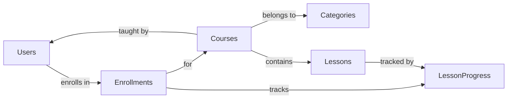
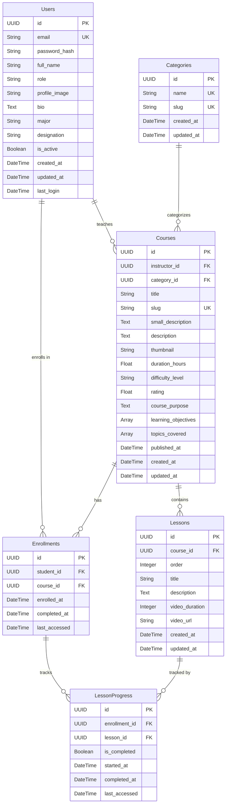

# 🗄️ Database Schema — LJCourses Platform

> Complete schema documentation for the LJCourses learning platform.
> All primary keys use **UUID v4**. Timestamps use **DateTime** with auto-population.

---

## Overview

The database consists of **6 tables** organized around users, courses, and progress tracking:

---

## 👤 Users (`users`)

Stores all users — **students**, **instructors**, and **admins** — in a single table differentiated by `role`.

| Column          | Type          | Constraints                   | Description                            |
|:----------------|:--------------|:------------------------------|:---------------------------------------|
| `id`            | `UUID`        | **PK**, default `uuid4`       | Unique identifier                      |
| `email`         | `String(120)` | **Unique**, Not Null, Indexed | User email address                     |
| `password_hash` | `String(255)` | Not Null                      | Bcrypt/Werkzeug hashed password        |
| `full_name`     | `String(100)` | Not Null                      | Display name                           |
| `role`          | `String(20)`  | Not Null, default `'student'` | One of: `student`, `instructor`, `hod` |
| `profile_image` | `String(255)` | Nullable                      | Path to uploaded profile photo         |
| `bio`           | `Text`        | Nullable                      | User biography                         |
| `major`         | `String(100)` | Nullable                      | Student's field of study               |
| `designation`   | `String(200)` | Nullable                      | Professional title (for instructors)   |
| `is_active`     | `Boolean`     | default `False`               | Account active status                  |
| `created_at`    | `DateTime`    | Not Null, auto                | Account creation timestamp             |
| `updated_at`    | `DateTime`    | auto on update                | Last modification timestamp            |
| `last_login`    | `DateTime`    | Nullable                      | Most recent login timestamp            |

**Relationships:**
- `enrollments` → One-to-Many with `Enrollment` (as student)
- `courses` → One-to-Many with `Course` (as instructor)

---

## 📂 Categories (`categories`)

Course categories for organization and filtering.

| Column       | Type          | Constraints                   | Description                 |
|:-------------|:--------------|:------------------------------|:----------------------------|
| `id`         | `UUID`        | **PK**, default `uuid4`       | Unique identifier           |
| `name`       | `String(100)` | **Unique**, Not Null          | Category display name       |
| `slug`       | `String(100)` | **Unique**, Not Null, Indexed | URL-friendly identifier     |
| `created_at` | `DateTime`    | Not Null, auto                | Creation timestamp          |
| `updated_at` | `DateTime`    | auto on update                | Last modification timestamp |

**Relationships:**
- `courses` → One-to-Many with `Course`

---

## 📚 Courses (`courses`)

Core course information including metadata, content details, and extended descriptions.

| Column                | Type            | Constraints                        | Description                                  |
|:----------------------|:----------------|:-----------------------------------|:---------------------------------------------|
| `id`                  | `UUID`          | **PK**, default `uuid4`            | Unique identifier                            |
| `instructor_id`       | `UUID`          | **FK** → `users.id`, Not Null      | Course instructor                            |
| `category_id`         | `UUID`          | **FK** → `categories.id`, Not Null | Course category                              |
| `title`               | `String(200)`   | Not Null                           | Course title                                 |
| `slug`                | `String(200)`   | **Unique**, Not Null, Indexed      | URL-friendly identifier                      |
| `small_description`   | `Text`          | Nullable                           | Brief summary for cards                      |
| `description`         | `Text`          | Nullable                           | Full course description                      |
| `thumbnail`           | `String(500)`   | Nullable                           | Thumbnail image URL                          |
| `duration_hours`      | `Float`         | Nullable                           | Total duration in hours (e.g., `12.5`)       |
| `difficulty_level`    | `String(50)`    | Nullable                           | e.g., `Beginner`, `Intermediate`, `Advanced` |
| `rating`              | `Float`         | Nullable, default `0.0`            | Average rating (0–5)                         |
| `course_purpose`      | `Text`          | Nullable                           | Why take this course                         |
| `learning_objectives` | `ARRAY(Text)`   | Nullable                           | List of learning outcomes                    |
| `topics_covered`      | `ARRAY(String)` | Nullable                           | List of topics                               |
| `published_at`        | `DateTime`      | Nullable                           | Publication date                             |
| `created_at`          | `DateTime`      | Not Null, auto                     | Creation timestamp                           |
| `updated_at`          | `DateTime`      | auto on update                     | Last modification timestamp                  |

**Relationships:**
- `instructor` → Many-to-One with `User`
- `category` → Many-to-One with `Category`
- `lessons` → One-to-Many with `Lesson` (ordered by `Lesson.order`, cascade delete)
- `enrollments` → One-to-Many with `Enrollment` (cascade delete)

---

## 🎬 Lessons (`lessons`)

Individual video lessons within a course, ordered sequentially.

| Column           | Type          | Constraints                     | Description                       |
|:-----------------|:--------------|:--------------------------------|:----------------------------------|
| `id`             | `UUID`        | **PK**, default `uuid4`         | Unique identifier                 |
| `course_id`      | `UUID`        | **FK** → `courses.id`, Not Null | Parent course                     |
| `order`          | `Integer`     | Not Null                        | Sequential position within course |
| `title`          | `String(200)` | Not Null                        | Lesson title                      |
| `description`    | `Text`        | Nullable                        | Lesson description                |
| `video_duration` | `Integer`     | Nullable                        | Duration in **seconds**           |
| `video_url`      | `String(500)` | Nullable                        | YouTube or video file URL         |
| `created_at`     | `DateTime`    | Not Null, auto                  | Creation timestamp                |
| `updated_at`     | `DateTime`    | auto on update                  | Last modification timestamp       |

**Relationships:**
- `course` → Many-to-One with `Course`
- `lesson_progress` → One-to-Many with `LessonProgress` (cascade delete)

---

## 📝 Enrollments (`enrollments`)

Links students to courses they've enrolled in.

| Column          | Type       | Constraints                     | Description                     |
|:----------------|:-----------|:--------------------------------|:--------------------------------|
| `id`            | `UUID`     | **PK**, default `uuid4`         | Unique identifier               |
| `student_id`    | `UUID`     | **FK** → `users.id`, Not Null   | Enrolled student                |
| `course_id`     | `UUID`     | **FK** → `courses.id`, Not Null | Enrolled course                 |
| `enrolled_at`   | `DateTime` | Not Null, auto                  | Enrollment date                 |
| `completed_at`  | `DateTime` | Nullable                        | Completion date (if finished)   |
| `last_accessed` | `DateTime` | Nullable                        | Last time student opened course |

> **Constraint:** `UNIQUE(student_id, course_id)` — A student can only enroll once per course.

**Relationships:**
- `student` → Many-to-One with `User`
- `course` → Many-to-One with `Course`
- `lesson_progress` → One-to-Many with `LessonProgress` (cascade delete)

---

## 📈 Lesson Progress (`lesson_progress`)

Tracks per-lesson completion status for each enrollment.

| Column          | Type       | Constraints                         | Description                          |
|:----------------|:-----------|:------------------------------------|:-------------------------------------|
| `id`            | `UUID`     | **PK**, default `uuid4`             | Unique identifier                    |
| `enrollment_id` | `UUID`     | **FK** → `enrollments.id`, Not Null | Parent enrollment                    |
| `lesson_id`     | `UUID`     | **FK** → `lessons.id`, Not Null     | Associated lesson                    |
| `is_completed`  | `Boolean`  | default `False`                     | Whether the lesson is complete       |
| `started_at`    | `DateTime` | Nullable                            | When the student started the lesson  |
| `completed_at`  | `DateTime` | Nullable                            | When the student finished the lesson |
| `last_accessed` | `DateTime` | Nullable                            | Last access timestamp                |

**Relationships:**
- `enrollment` → Many-to-One with `Enrollment`
- `lesson` → Many-to-One with `Lesson`

---

## 🔗 Entity Relationship Diagram

