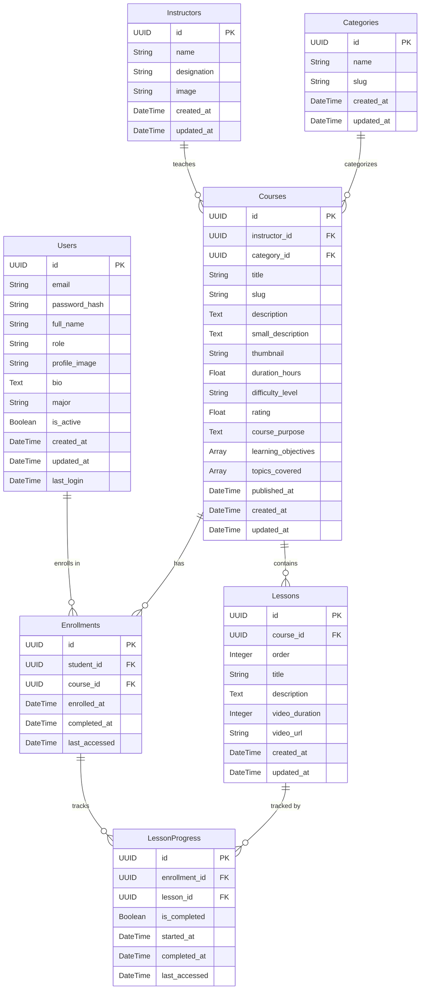

# Database Schema Documentation

This document outlines the database schema for the LJCourses platform, including tables, columns, and relationships.

## Users Table (`users`)

Stores information about all users (students, instructors, admins).

| Column          | Type        | Description                            |
|:----------------|:------------|:---------------------------------------|
| `id`            | UUID        | Primary Key                            |
| `email`         | String(120) | Unique email address                   |
| `password_hash` | String(255) | Hashed password                        |
| `full_name`     | String(100) | User's full name                       |
| `role`          | String(20)  | Role: 'student', 'instructor', 'admin' |
| `profile_image` | String(255) | URL to profile image                   |
| `bio`           | Text        | User biography                         |
| `major`         | String(100) | Student's major or field of study      |
| `is_active`     | Boolean     | Account status                         |
| `created_at`    | DateTime    | Timestamp of creation                  |
| `updated_at`    | DateTime    | Timestamp of last update               |
| `last_login`    | DateTime    | Timestamp of last login                |

## Instructors Table (`instructors`)

Stores details specific to instructors.

| Column        | Type        | Description              |
|:--------------|:------------|:-------------------------|
| `id`          | UUID        | Primary Key              |
| `name`        | String(100) | Instructor's name        |
| `designation` | String(200) | Professional title       |
| `image`       | String(500) | URL to instructor image  |
| `created_at`  | DateTime    | Timestamp of creation    |
| `updated_at`  | DateTime    | Timestamp of last update |

## Categories Table (`categories`)

Categorizes courses.

| Column       | Type        | Description                |
|:-------------|:------------|:---------------------------|
| `id`         | UUID        | Primary Key                |
| `name`       | String(100) | Category name (Unique)     |
| `slug`       | String(100) | URL-friendly slug (Unique) |
| `created_at` | DateTime    | Timestamp of creation      |
| `updated_at` | DateTime    | Timestamp of last update   |

## Courses Table (`courses`)

Stores course information.

| Column                | Type          | Description                     |
|:----------------------|:--------------|:--------------------------------|
| `id`                  | UUID          | Primary Key                     |
| `instructor_id`       | UUID          | Foreign Key -> `instructors.id` |
| `category_id`         | UUID          | Foreign Key -> `categories.id`  |
| `title`               | String(200)   | Course title                    |
| `slug`                | String(200)   | URL-friendly slug (Unique)      |
| `description`         | Text          | Detailed course description     |
| `small_description`   | Text          | Brief summary                   |
| `thumbnail`           | String(500)   | URL to thumbnail image          |
| `duration_hours`      | Float         | Course duration in hours        |
| `difficulty_level`    | String(50)    | Difficulty level                |
| `rating`              | Float         | Average rating (0-5)            |
| `course_purpose`      | Text          | Purpose of the course           |
| `learning_objectives` | ARRAY(Text)   | List of objectives              |
| `topics_covered`      | ARRAY(String) | List of topics                  |
| `published_at`        | DateTime      | Publication date                |
| `created_at`          | DateTime      | Timestamp of creation           |
| `updated_at`          | DateTime      | Timestamp of last update        |

## Lessons Table (`lessons`)

Individual lessons within a course.

| Column           | Type        | Description                 |
|:-----------------|:------------|:----------------------------|
| `id`             | UUID        | Primary Key                 |
| `course_id`      | UUID        | Foreign Key -> `courses.id` |
| `order`          | Integer     | Order of the lesson         |
| `title`          | String(200) | Lesson title                |
| `description`    | Text        | Lesson description          |
| `video_duration` | Integer     | Duration in seconds         |
| `video_url`      | String(500) | URL to video file           |
| `created_at`     | DateTime    | Timestamp of creation       |
| `updated_at`     | DateTime    | Timestamp of last update    |

## Enrollments Table (`enrollments`)

Tracks student usage of courses.

| Column          | Type     | Description                        |
|:----------------|:---------|:-----------------------------------|
| `id`            | UUID     | Primary Key                        |
| `student_id`    | UUID     | Foreign Key -> `users.id`          |
| `course_id`     | UUID     | Foreign Key -> `courses.id`        |
| `enrolled_at`   | DateTime | Date of enrollment                 |
| `completed_at`  | DateTime | Date of completion (if applicable) |
| `last_accessed` | DateTime | Timestamp of last access           |

**Constraints**: Unique constraint on (`student_id`, `course_id`).

## Lesson Progress Table (`lesson_progress`)

Tracks completion status of individual lessons.

| Column          | Type     | Description                     |
|:----------------|:---------|:--------------------------------|
| `id`            | UUID     | Primary Key                     |
| `enrollment_id` | UUID     | Foreign Key -> `enrollments.id` |
| `lesson_id`     | UUID     | Foreign Key -> `lessons.id`     |
| `is_completed`  | Boolean  | Completion status               |
| `started_at`    | DateTime | When the lesson was started     |
| `completed_at`  | DateTime | When the lesson was completed   |
| `last_accessed` | DateTime | Last accessed timestamp         |

## ER Diagram (Textual Representation)

